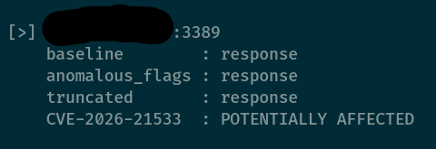

# RDPulse - RDP Exposure & Behavioral Scanner

**RDP Pre-Authentication Behavioral Scan Tool**  
**Author:** Rodrigo Bash  
**Contact:** rodrigo@bashsecurity.com.br  

## Overview

RDPulse is a lightweight, **non-exploitative** scanner that performs pre-authentication behavioral assessment of Remote Desktop Protocol (RDP) services exposed on TCP port 3389.

It **does NOT** attempt to exploit vulnerabilities, authenticate, brute-force credentials, or deliver payloads. Instead, it evaluates how strictly (or leniently) the RDP service parses negotiation packets during the initial connection phase — before any authentication occurs.

The scan uses three types of negotiation packets for comparison:

1. **Baseline** — A minimally valid RDP negotiation request (expected to be accepted by compliant servers)
2. **Malformed** — Same structure but with anomalous flags
3. **Truncated** — Severely incomplete / shortened packet

By observing responses (or lack thereof), the tool classifies hosts based on protocol handling strictness.

## Purpose

- Discover exposed RDP services across network ranges
- Measure pre-authentication protocol parsing tolerance
- Identify services with lenient behavior (which may indicate less hardening)
- Support risk prioritization and defensive validation in authorized environments
- Provide objective, defensible evidence for security assessments

Host classification:

- **NOT ASSESSABLE**  
  No observable response even to the valid baseline packet.

- **EXPOSED BUT STRICT**  
  Responds to valid negotiation but rejects or handles malformed/truncated packets differently.

- **POTENTIALLY LENIENT**  
  Responds consistently (with data) to valid, malformed, **and** truncated packets — indicating tolerant parsing behavior that may warrant further review.

**Note:** Behavioral leniency does **not** confirm exploitability or a specific vulnerability. It is an indicator only.

## Important Limitations

This tool **does NOT**:

- Confirm or test for any specific CVE (including CVE-2026-21533 or others)
- Authenticate to the target
- Perform credential guessing or attacks
- Execute code or trigger memory issues
- Detect patch levels, RDP versions, or actual vulnerabilities

Results can be affected by:

- Firewalls, IPS/IDS
- RDP gateways or load balancers
- Network segmentation
- Rate limiting or connection timeouts

## Intended Use

For **authorized** use only:

- Security assessments
- Red team reconnaissance (non-invasive phase)
- Blue team / defensive validation of exposed RDP surfaces

**Always obtain explicit permission** before scanning any network.

## Disclaimer

RDPulse is provided **as-is** for educational and professional security testing purposes in authorized environments. The author is **not** responsible for misuse, damage, or legal consequences from unauthorized scanning.

Behavioral tolerance is **not** equivalent to a confirmed vulnerability.

## Usage

```bash
python3 RDPulse.py <NET/MASK>

## Usage Example

Run the tool against a network range:

```bash
python3 RDPulse.py 192.168.0.0/24

## Example Output



